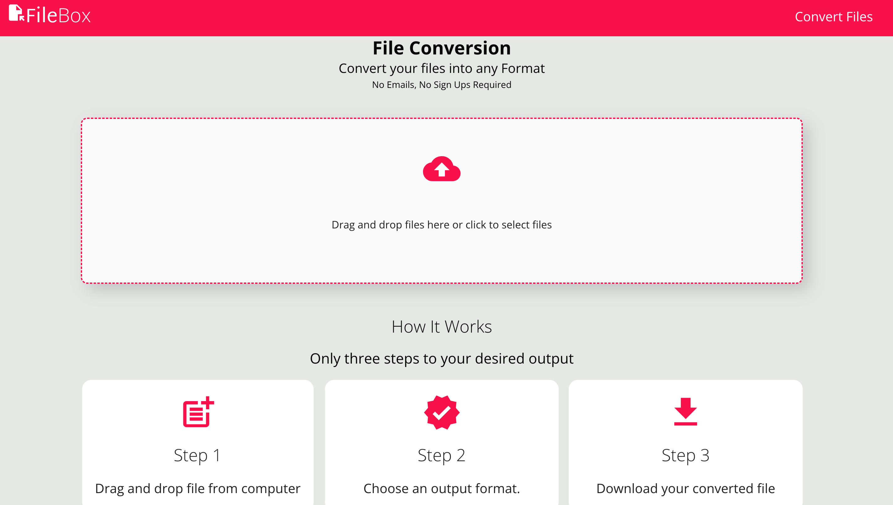

# FileBox

FileBox is one-stop app for conversion and transfer of large files. This version support converting files into various formats

- Docs
- Pdf
- xls
- csv
- html
- webp
- jpg
- png

Follow these steps to use the app

- Drag and drop the file from your computer
- Choose the output format
- Convert and download file

[Click here to start usage](https://fileboxs.netlify.app/)

## Features

- Convert file to various format
- Transfer or share larger files (coming soon)

## Installation

- git clone https://github.com/emmanuelkumah/useConvertly.git
- In your development terminal enter the command npm install
- Enter the command npm run dev to run the app

## Contributing

Pull requests are welcome. For major changes, please open an issue first
to discuss what you would like to change.

## Roadmap

- Transfer or share large files
